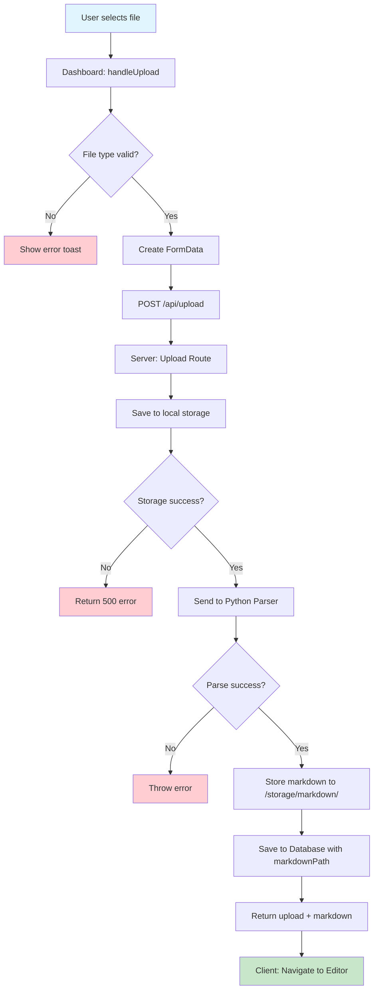
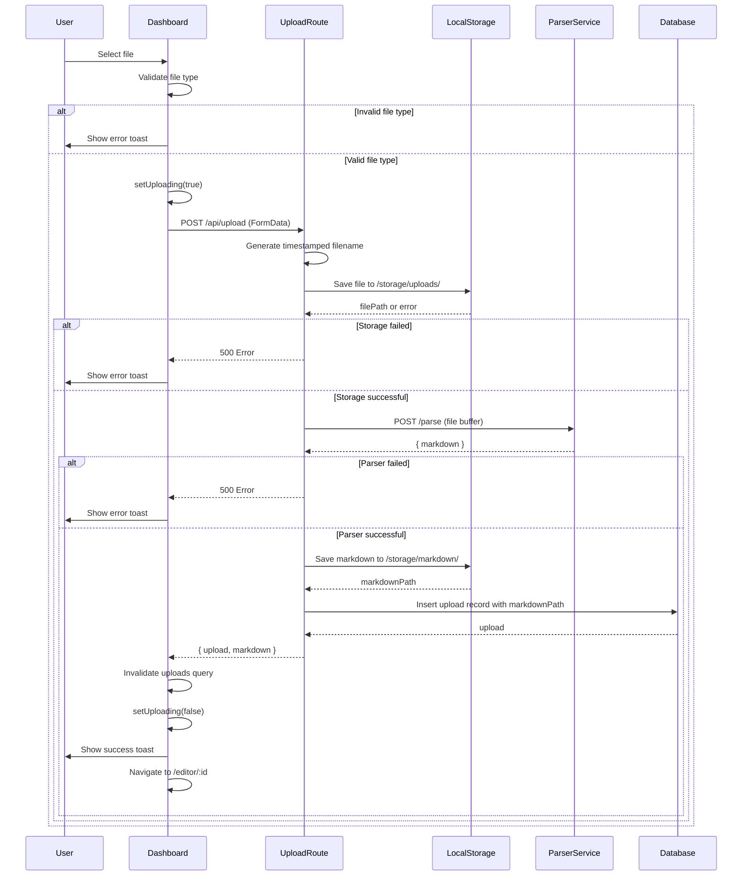
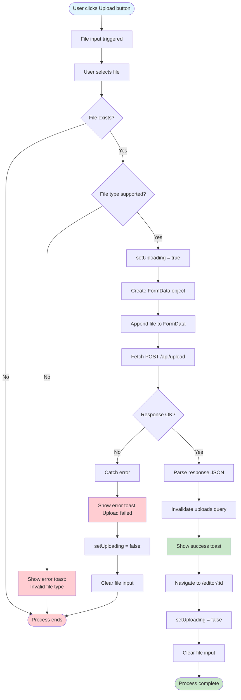
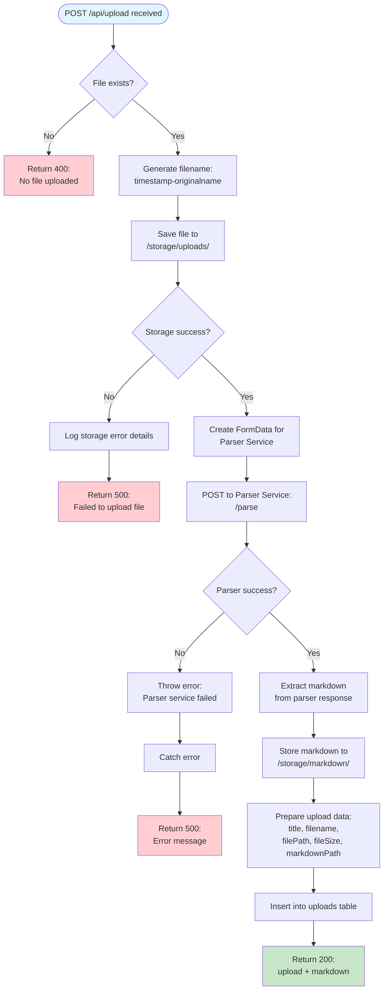
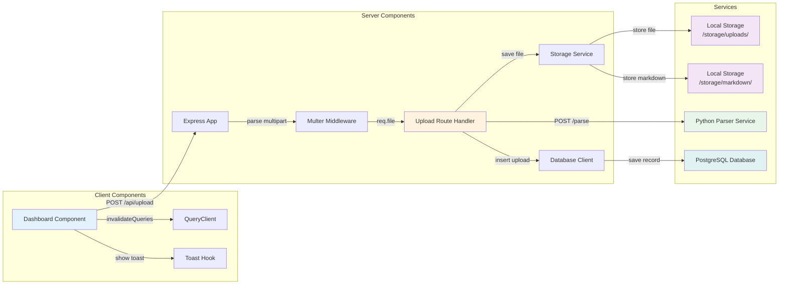
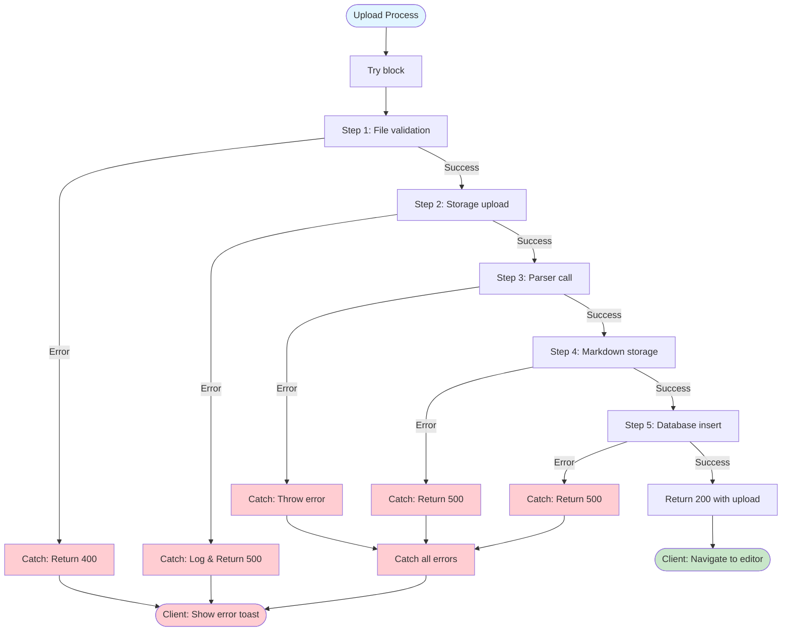
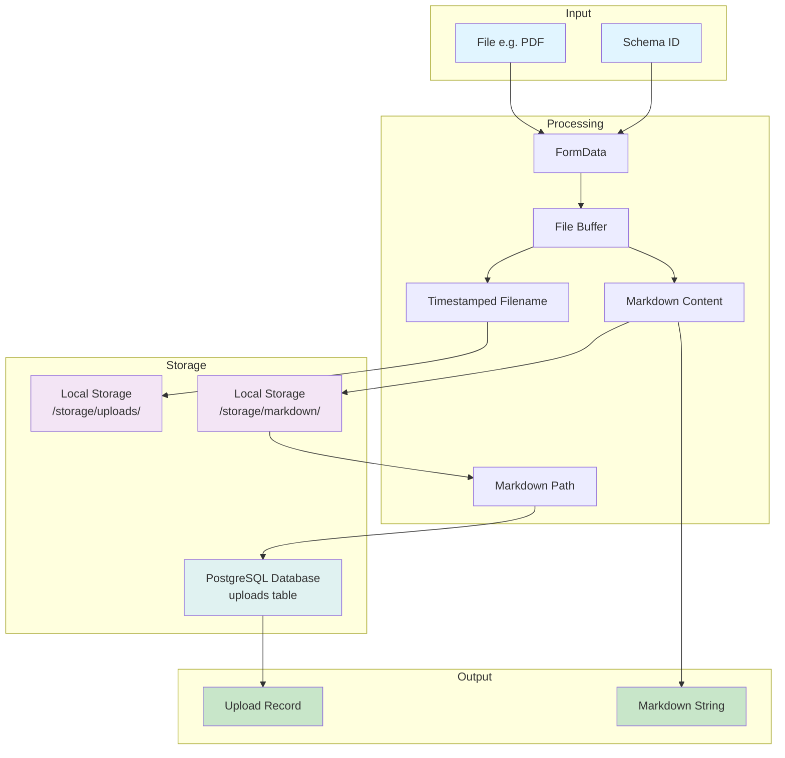

# File Upload Process Documentation

This document outlines the complete flow of uploading and processing files in ChunkForge, from the Dashboard UI through the server-side processing pipeline.

## Overview

The upload process involves multiple components working together:
1. **Client-side (Dashboard)**: File selection, validation, and upload initiation
2. **Server-side (Upload Route)**: File storage, parsing, and database persistence
3. **External Services**: Local Filesystem Storage and Python Parser Service

## Database Schema

### Uploads Table
```sql
CREATE TABLE uploads (
  id UUID PRIMARY KEY DEFAULT gen_random_uuid(),
  title TEXT NOT NULL,
  original_filename TEXT NOT NULL,
  file_path TEXT NOT NULL,
  file_size INTEGER NOT NULL,
  chunking_strategy TEXT NOT NULL DEFAULT 'none',
  metadata JSONB DEFAULT '{}',
  schema_id UUID REFERENCES metadata_schemas(id),
  custom_metadata JSONB DEFAULT '{}',
  markdown TEXT,                    -- Legacy: kept for backward compatibility
  markdown_path TEXT,               -- Path to markdown file in storage
  created_at TIMESTAMP DEFAULT NOW(),
  updated_at TIMESTAMP DEFAULT NOW()
);
```

### Chunks Table
```sql
CREATE TABLE chunks (
  id UUID PRIMARY KEY DEFAULT gen_random_uuid(),
  upload_id UUID NOT NULL REFERENCES uploads(id) ON DELETE CASCADE,
  content TEXT NOT NULL,
  markdown_content TEXT NOT NULL,
  position INTEGER NOT NULL,
  start_offset INTEGER,
  end_offset INTEGER,
  has_overlap BOOLEAN DEFAULT FALSE,
  metadata JSONB DEFAULT '{}',
  created_at TIMESTAMP DEFAULT NOW(),
  updated_at TIMESTAMP DEFAULT NOW()
);
```

### Storage Directories
- **`/storage/uploads/`**: Stores the original uploaded files (PDFs, etc.)
- **`/storage/markdown/`**: Stores the converted markdown content as separate files

## High-Level Architecture Flow



## Detailed Sequence Diagram



## Client-Side Process Flow (Dashboard)



## Server-Side Process Flow (Upload Route)



## Component Interaction Diagram



## Error Handling Flow



## Data Flow Diagram



## API Endpoints

### Upload Endpoints

| Method | Endpoint | Description |
|--------|----------|-------------|
| POST | `/api/upload` | Upload a new file |
| GET | `/api/uploads` | List all uploads |
| GET | `/api/uploads/:uploadId` | Get single upload with markdown |
| PATCH | `/api/uploads/:uploadId` | Update upload metadata |
| DELETE | `/api/uploads/:uploadId` | Delete upload and associated data |
| PATCH | `/api/uploads/:uploadId/schema` | Apply or remove schema from upload |

### Chunk Endpoints

| Method | Endpoint | Description |
|--------|----------|-------------|
| GET | `/api/uploads/:uploadId/chunks` | Get all chunks for an upload |
| POST | `/api/uploads/:uploadId/chunks` | Save chunks for an upload |
| DELETE | `/api/uploads/:uploadId/chunks` | Delete all chunks for an upload |

### Response Format

**Upload Response:**
```json
{
  "upload": {
    "id": "uuid",
    "title": "Document Title",
    "originalFilename": "document.pdf",
    "filePath": "uploads/1234567890-document.pdf",
    "fileSize": 1024000,
    "chunkingStrategy": "none",
    "metadata": {},
    "schemaId": "uuid | null",
    "customMetadata": {},
    "markdown": null,
    "markdownPath": "markdown/uuid.md",
    "createdAt": "2024-01-01T00:00:00.000Z",
    "updatedAt": "2024-01-01T00:00:00.000Z"
  },
  "markdown": "# Document content..."
}
```

## Key Components

### Client-Side (`dashboard.tsx`)

**Key Functions:**
- `handleUpload`: Main upload handler that validates file, creates FormData, and sends request
- `deleteMutation`: Handles upload deletion with query invalidation

**State Management:**
- `uploading`: Boolean state to track upload progress
- `fileInputRef`: Reference to hidden file input element
- React Query for upload fetching and cache management

**User Feedback:**
- Toast notifications for success/error states
- Loading spinner during upload
- Automatic navigation to editor on success

### Client-Side (`UploadDialog.tsx`)

**Supported File Types:**
```typescript
const SUPPORTED_FILE_TYPES = [
  'application/pdf',
  // Future support can be added here
];

const SUPPORTED_EXTENSIONS = '.pdf';
```

**Features:**
- Drag and drop file upload
- File type validation
- Schema selection (required)
- Upload progress indication

### Server-Side (`upload.ts`)

**Key Steps:**
1. **File Validation**: Checks if file exists in request
2. **File Storage**: Saves file buffer to `/storage/uploads/` directory
3. **Parser Integration**: Sends file to Python parser service for markdown conversion
4. **Markdown Storage**: Stores converted markdown to `/storage/markdown/` directory
5. **Database Persistence**: Saves upload metadata with `markdownPath` to PostgreSQL

**Error Handling:**
- 400: No file uploaded
- 500: Storage upload failure, parser service failure, or database error

**File Naming:**
- Format: `${Date.now()}-${req.file.originalname}`
- Ensures unique filenames and prevents collisions

### Server-Side (`uploads.ts`)

**Markdown Retrieval:**
```typescript
async function getMarkdownContent(upload: Upload): Promise<string | null> {
  // Try markdownPath first (new storage method)
  if (upload.markdownPath) {
    const content = await downloadText('markdown', upload.markdownPath);
    if (content) {
      return content;
    }
  }
  // Fall back to markdown column (legacy)
  return upload.markdown || null;
}
```

## Environment Variables

- `PARSER_SERVICE_URL`: URL of the Python parser service (defaults to `http://localhost:8000`)
- `DATABASE_URL`: PostgreSQL connection string

## Dependencies

### Client
- `@tanstack/react-query`: Query management and cache invalidation
- `react-router-dom`: Navigation after successful upload
- `date-fns`: Date formatting for upload display

### Server
- `multer`: Multipart form data parsing
- `express`: HTTP server framework
- `drizzle-orm`: Database ORM for PostgreSQL

## Notes

- The upload process is synchronous and blocking - the client waits for the entire process to complete
- File size is stored in the database for reference
- Markdown content is stored in a separate storage directory for better organization
- The `markdown` column is kept for backward compatibility but new uploads use `markdownPath`
- The chunking strategy is initially set to `'none'` and will be updated when chunking is applied
- The system is designed to support multiple file types in the future (not just PDFs)
