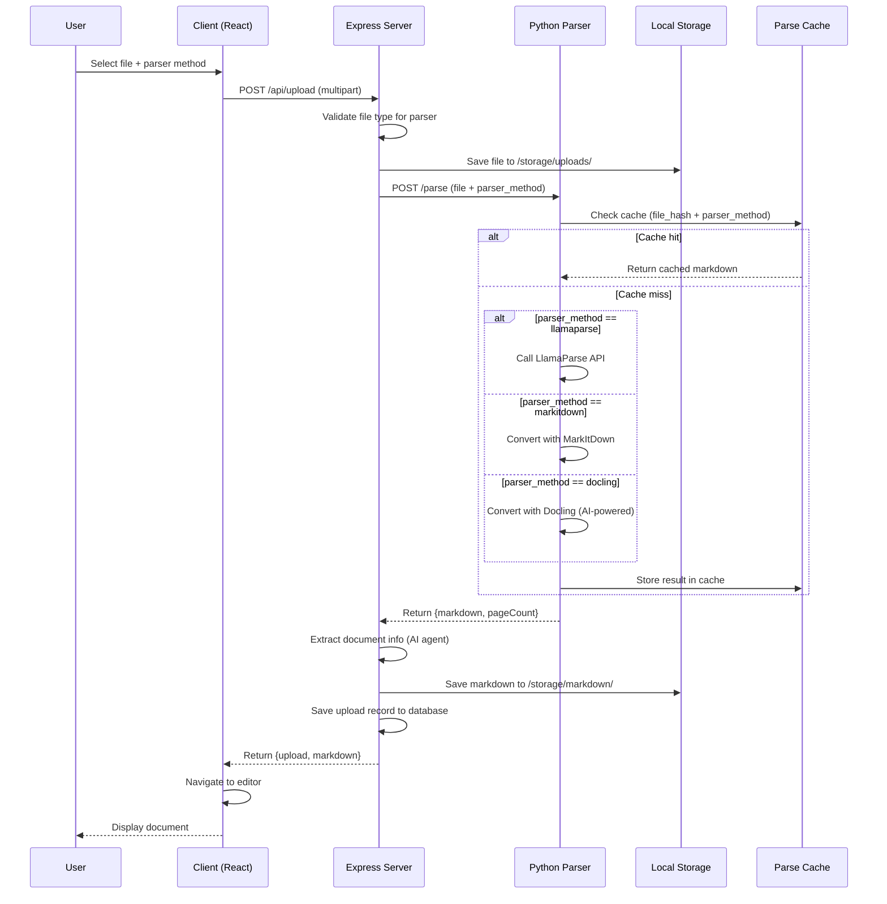

# Parsing Process Overview

## Architecture

ChunkForge uses a three-tier architecture for document parsing:

```
┌─────────────────┐     ┌─────────────────┐     ┌─────────────────┐
│     Client      │────▶│  Express Server │────▶│  Python Parser  │
│   (React/Vite)  │◀────│    (Node.js)    │◀────│    (FastAPI)    │
└─────────────────┘     └─────────────────┘     └─────────────────┘
        │                       │                       │
        │                       ▼                       ▼
        │               ┌─────────────────┐     ┌─────────────────┐
        │               │  Local Storage  │     │   File Cache    │
        │               │   /storage/     │     │  ./cache/parses │
        │               └─────────────────┘     └─────────────────┘
        │                       │
        └───────────────────────┘
                 (Storage)
```

## Complete Data Flow



## Service Responsibilities

### Client (`client/src/`)

**Role**: User interface for file selection and parser method choice.

**Key Files**:
- `components/UploadDialog.tsx` - Parser selection UI, file type filtering
- `pages/dashboard.tsx` - Upload handler, API call orchestration

**Responsibilities**:
1. Display parser method toggle (LlamaParse vs MarkItDown vs Docling)
2. Filter accepted file types based on parser selection
3. Build FormData with file, schemaId, and parserMethod
4. Send upload request to Express server
5. Handle success/error responses
6. Navigate to editor on success

**Code Flow**:
```typescript
// UploadDialog.tsx
const [parserMethod, setParserMethod] = useState<ParserMethod>('llamaparse');

// Dynamic file acceptance
accept={SUPPORTED_EXTENSIONS[parserMethod]}

// Pass to handler
onUpload(file, schemaId, parserMethod)
```

```typescript
// dashboard.tsx
const handleUpload = async (file, schemaId, parserMethod) => {
  const formData = new FormData();
  formData.append('file', file);
  formData.append('schemaId', schemaId);
  formData.append('parserMethod', parserMethod);

  const response = await fetch('/api/upload', {
    method: 'POST',
    body: formData,
  });
  // ...
};
```

---

### Express Server (`server/`)

**Role**: API gateway, storage orchestration, database management.

**Key Files**:
- `routes/upload.ts` - Main upload endpoint
- `services/storage.ts` - Local filesystem storage

**Responsibilities**:
1. Validate parser method and file type compatibility
2. Save original file to local storage
3. Forward file to Python parser service
4. Extract document metadata via AI agent (optional)
5. Save parsed markdown to storage
6. Create database record
7. Return response to client

**Code Flow**:
```typescript
// routes/upload.ts
app.post("/api/upload", upload.single("file"), async (req, res) => {
  // 1. Get parser method
  const parserMethod = req.body.parserMethod || 'llamaparse';

  // 2. Validate file type
  if (!SUPPORTED_MIME_TYPES[parserMethod].includes(req.file.mimetype)) {
    return res.status(400).json({ error: 'Unsupported file type' });
  }

  // 3. Save to local storage
  await uploadFile('uploads', fileName, buffer);

  // 4. Call parser service
  formData.append("parser_method", parserMethod);
  const response = await fetch(`${parserUrl}/parse`, { body: formData });

  // 5. Save markdown and return
  await uploadText('markdown', markdownFilename, markdown);
  const [newUpload] = await db.insert(uploads).values({...});
  res.json({ upload: newUpload, markdown });
});
```

---

### Python Parser (`parser/`)

**Role**: Document-to-Markdown conversion with multiple parser backends.

**Key Files**:
- `main.py` - FastAPI endpoints
- `llama_parser.py` - LlamaParse implementation
- `markitdown_parser.py` - MarkItDown implementation
- `docling_parser.py` - Docling implementation
- `cache.py` - Result caching

**Responsibilities**:
1. Receive file and parser method from Express
2. Check cache for existing result
3. Route to appropriate parser (LlamaParse, MarkItDown, or Docling)
4. Extract page count for PDFs
5. Cache successful results
6. Return markdown and metadata

**Code Flow**:
```python
# main.py
@app.post("/parse")
async def parse_document(
    file: UploadFile,
    parser_method: str = Form("llamaparse")
):
    # Save temp file
    with tempfile.NamedTemporaryFile(suffix=file_ext) as tmp:
        tmp.write(await file.read())

        if parser_method == "docling":
            result = parse_with_docling(tmp.name)
        elif parser_method == "markitdown":
            result = parse_with_markitdown(tmp.name)
        else:
            result = parse_pdf(tmp.name, config)

    return {"markdown": result.markdown, "pageCount": result.page_count}
```

```python
# llama_parser.py
def parse_pdf(file_path, config):
    cache = get_parse_cache()
    cached = cache.get(file_hash, config, parser_method="llamaparse")
    if cached:
        return ParseResult(markdown=cached, page_count=page_count)

    # Call LlamaParse API
    parser = LlamaParse(api_key=api_key, ...)
    documents = parser.load_data(file_path)
    markdown = "\n\n".join([doc.text for doc in documents])

    cache.set(file_hash, config, markdown, parser_method="llamaparse")
    return ParseResult(markdown=markdown, page_count=page_count)
```

---

## File Type Support Matrix

| File Type | MIME Type | LlamaParse | MarkItDown | Docling |
|-----------|-----------|:----------:|:----------:|:-------:|
| PDF | `application/pdf` | Yes | Yes | Yes |
| Word | `application/vnd...wordprocessingml.document` | No | Yes | Yes |
| PowerPoint | `application/vnd...presentationml.presentation` | No | No | Yes |
| Excel | `application/vnd...spreadsheetml.sheet` | No | Yes | Yes |
| CSV | `text/csv` | No | Yes | No |
| HTML | `text/html` | No | No | Yes |
| PNG | `image/png` | No | No | Yes |
| JPEG | `image/jpeg` | No | No | Yes |

---

## Parser Comparison

| Parser | Requirements | Quality | Best For |
|--------|--------------|---------|----------|
| LlamaParse | API key required | Highest | Complex PDFs, tables, layouts |
| MarkItDown | No requirements | Good | Simple documents, Office files |
| Docling | No requirements | High | Multi-format, OCR, images |

---

## Caching Strategy

### Cache Key Generation
```
SHA256(file_hash + parser_method + config_json)
```

This ensures:
- Same file with different parser methods = separate cache entries
- Same file with different configs = separate cache entries
- Identical requests = cache hit

### Cache Structure
```
./cache/parses/
├── abc123...def.json   # LlamaParse result for file A
├── ghi456...jkl.json   # MarkItDown result for file A
└── mno789...pqr.json   # LlamaParse result for file B (different config)
```

### Cache Entry Format
```json
{
  "file_hash": "abc123...",
  "config": {"language": "en"},
  "markdown": "# Document...",
  "parser_method": "llamaparse",
  "timestamp": 1699999999.0
}
```

---

## Error Handling

### Client-Side Errors
| Error | Handling |
|-------|----------|
| Invalid file type | Prevented by `accept` attribute |
| Upload failed | Toast notification with error message |

### Server-Side Errors
| Error | HTTP Status | Response |
|-------|-------------|----------|
| Invalid parser method | 400 | `{ error: "Invalid parser method" }` |
| Unsupported file type | 400 | `{ error: "File type not supported" }` |
| Parser service failed | 500 | `{ error: "Parser service failed" }` |

### Parser-Side Errors
| Error | Cause | Resolution |
|-------|-------|------------|
| Missing API key | `LLAMA_CLOUD_API_KEY` not set | Set environment variable |
| Invalid config | Bad JSON in config | Falls back to defaults |
| Parse failure | Document issue | Returns 500 with details |

---

## Environment Variables

### Express Server
| Variable | Default | Description |
|----------|---------|-------------|
| `PARSER_SERVICE_URL` | `http://localhost:8000` | Python parser URL |
| `DATABASE_URL` | - | PostgreSQL connection string |

### Python Parser
| Variable | Default | Description |
|----------|---------|-------------|
| `LLAMA_CLOUD_API_KEY` | - | Required for LlamaParse |
| `PARSE_CACHE_DIR` | `./cache/parses` | Cache directory |
| `PARSE_CACHE_TTL` | `604800` | Cache TTL (7 days) |

---

## Testing the Parse Flow

### Manual Testing

1. **Start services**:
   ```bash
   # Terminal 1: Parser service
   cd parser && python main.py

   # Terminal 2: Express + Client
   npm run dev
   ```

2. **Test LlamaParse**:
   - Select a PDF file
   - Choose "LlamaParse" parser
   - Check markdown quality

3. **Test MarkItDown**:
   - Select a Word/Excel/CSV file
   - Choose "MarkItDown" parser
   - Check markdown output

4. **Test Caching**:
   - Upload same file twice
   - Second upload should be faster (cache hit)
   - Check `./cache/parses/` for cached files

---

## Related Documentation

- [LlamaParse Parser](./llama-parse.md) - Detailed LlamaParse documentation
- [MarkItDown Parser](./markitdown.md) - Detailed MarkItDown documentation
- [Docling Parser](./docling.md) - Detailed Docling documentation
- [Upload Process](../upload-process.md) - Full upload workflow documentation
